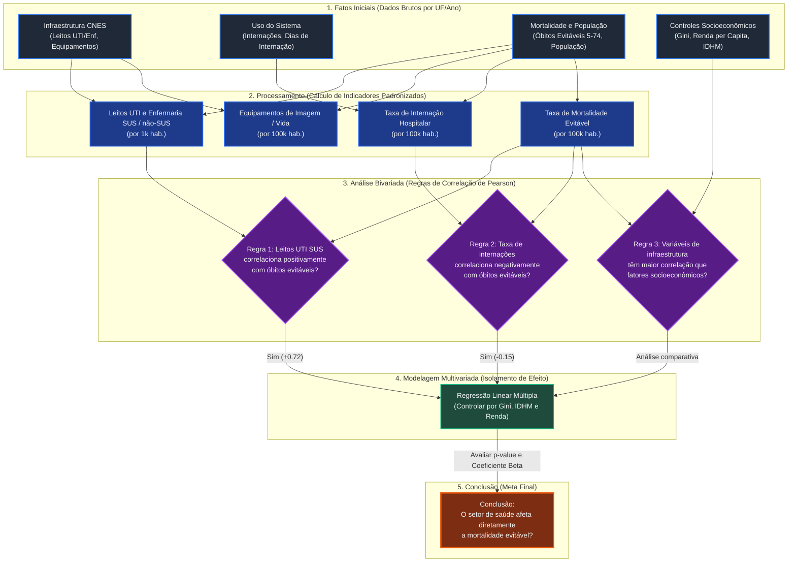
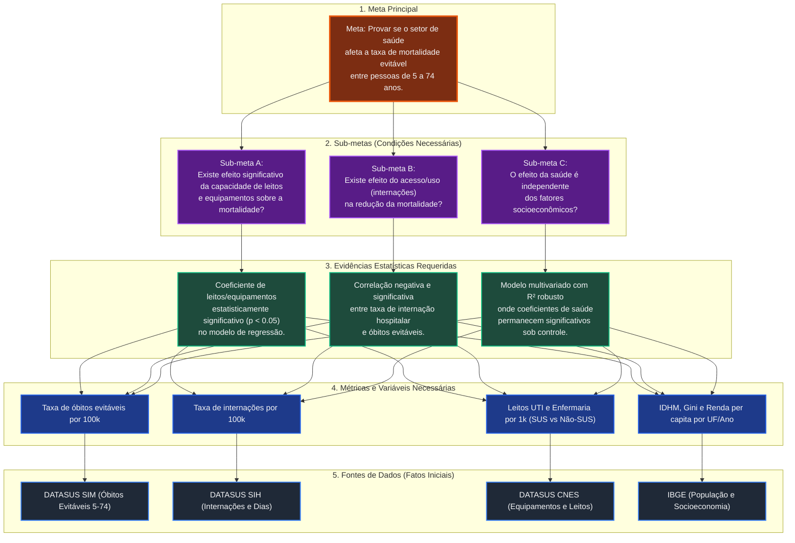

# Fluxograma de Análise: Impacto do Setor de Saúde na Mortalidade Evitável (5 a 74 anos)

Este documento apresenta duas abordagens metodológicas organizadas em fluxogramas de encadeamento (**Forward Chaining** e **Backward Chaining**) para estruturar a análise exploratória de dados e o storytelling de apresentação sobre o impacto do setor de saúde na mortalidade evitável.

---

## 1. Abordagem por Encadeamento para Frente (Forward Chaining)
*Orientada por Dados (Data-Driven)*: Inicia com os dados brutos e variáveis disponíveis, calcula indicadores, testa relações estatísticas e, através de regras de inferência, chega à conclusão.

### Diagrama Mermaid (Encadeamento para Frente)

### Roteiro de Storytelling: Do Dado ao Insight (Forward Chaining)
1. **A Origem**: Começamos com os dados reais de infraestrutura do CNES e de óbitos do DATASUS por Unidade Federativa.
2. **A Normalização**: Explicamos que, para comparar estados de tamanhos diferentes, transformamos números brutos em taxas (leitos por 1.000 habitantes, óbitos e internações por 100.000 habitantes).
3. **As Surpresas da Correlação**:
   - Mostramos que a **taxa de internação hospitalar** tem correlação negativa ($-0,15$), sugerindo que um maior volume de internações (acesso) está associado a menor mortalidade evitável.
   - Mostramos que a densidade de **leitos de UTI SUS** tem correlação positiva alta ($+0,72$). Isso nos leva ao insight de que a UTI é uma resposta reativa: onde há maior gravidade epidemiológica, há maior indução e instalação de leitos de terapia intensiva.
4. **O Controle de Variáveis**: Para garantir que isso não é apenas reflexo da riqueza do estado, rodamos uma regressão controlando por IDHM e Gini.
5. **O Veredicto**: Concluímos se a infraestrutura de saúde de fato reduz mortes evitáveis de forma independente das condições sociais.

---

## 2. Abordagem por Encadeamento para Trás (Backward Chaining)
*Orientada a Hipóteses (Goal-Driven)*: Começa com a pergunta final (a meta) e retrocede para encontrar as condições estatísticas necessárias, as sub-metas e, finalmente, os dados que suportam cada premissa.

### Diagrama Mermaid (Encadeamento para Trás)

### Roteiro de Storytelling: Do Problema à Evidência (Backward Chaining)
1. **A Pergunta de Milhão**: Iniciamos a apresentação com o questionamento: *"O investimento em infraestrutura e o acesso à saúde pública realmente reduzem as mortes que poderiam ser evitadas em pessoas de 5 a 74 anos no Brasil?"*
2. **As Condições de Prova**: Explicamos que, para responder "sim", precisamos provar três coisas (as sub-metas):
   - Que a quantidade de recursos hospitalares faz diferença.
   - Que o acesso a internações reduz a mortalidade.
   - Que o impacto do setor de saúde não é meramente um reflexo da desigualdade de renda ou IDHM regional.
3. **A Busca pela Evidência**:
   - Mostramos a análise de regressão múltipla, evidenciando se a presença de leitos e equipamentos afeta o indicador sob controle socioeconômico.
   - Apresentamos a taxa de internação hospitalar como um fator de proteção associado a menores óbitos evitáveis.
4. **Os Fundamentos no Dado Real**: Concluímos mostrando a base de dados consolidada que unificou SIM, CNES, SIH e dados socioeconômicos do IBGE.

---

## 3. Recomendações para a Análise Exploratória (EDA)
Com base nas correlações preliminares observadas nos dados consolidados:
* **Mortalidade Evitável 100k vs Leitos UTI SUS 1k ($+0.7267$):** Investigue essa correlação positiva. Crie um gráfico de dispersão com uma linha de tendência e destaque estados do Norte/Nordeste vs Sul/Sudeste. Demonstre que a alocação de UTI é frequentemente reativa à alta morbidade local.
* **Mortalidade Evitável 100k vs Internações 100k ($-0.1493$):** Plote a relação entre a taxa de internação e a mortalidade evitável. Isso sugere que o acesso hospitalar estruturado previne mortes por causas agudas tratáveis.
* **Leitos de Enfermaria SUS 1k ($-0.0003$):** Mostre que a distribuição simples de leitos de enfermaria comuns não possui correlação linear com a redução de mortes evitáveis de 5 a 74 anos, indicando a necessidade de especialização do cuidado (UTI, diagnóstico por imagem e tecnologias de suporte à vida).
