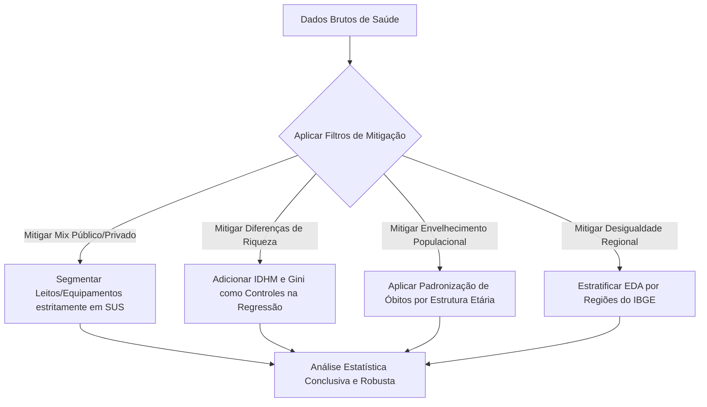

# Relatório de Viés Geográfico e Diretrizes Metodológicas

**Projeto:** Impacto do Setor de Saúde na Mortalidade Evitável (5 a 74 anos)  
**Objetivo:** Identificar as distorções espaciais e socioeconômicas inerentes aos dados de saúde pública no Brasil e definir estratégias estatísticas e de storytelling para blindar a análise contra conclusões espúrias.

---

## 1. O Fenômeno do Viés Geográfico na Saúde Brasileira

Ao analisar dados agregados por Unidade Federativa (UF), o pesquisador enfrenta o desafio da **desigualdade estrutural brasileira**. Indicadores de saúde e demografia não são distribuídos de forma homogênea, gerando três grandes categorias de viés:

### A. Viés de Confundimento Socioeconômico (Confounding)
Estados das regiões Sul e Sudeste possuem melhor infraestrutura sanitária, maior renda média e melhor nível educacional. Estes fatores reduzem a mortalidade evitável de forma independente do sistema de saúde.
*   **A Distorção:** Se a correlação indicar que *"mais leitos estão associados a menos mortes"*, o real motivo pode ser que estados mais ricos conseguem financiar mais leitos *e simultaneamente* sua população possui melhor qualidade de vida.

### B. Efeito da Concentração Metropolitana (Vazios Assistenciais)
O dado estadual consolidado calcula a média aritmética dos recursos.
*   **A Distorção:** Um estado com boa relação "Leitos/Habitante" pode ter 95% de sua capacidade instalada concentrada na região metropolitana da capital. Populações do interior continuam sofrendo com a falta de acesso a tempo hábil para condições agudas (como infarto ou trauma), mantendo a taxa de mortalidade evitável elevada. A média esconde a desigualdade espacial.

### C. Assimetria do Mix Público-Privado (SUS vs. Saúde Suplementar)
A proporção da população que depende do SUS varia drasticamente entre as UFs.
*   **A Distorção:** Em São Paulo, cerca de 40% da população utiliza planos de saúde privados (Não-SUS). Em estados como o Acre ou Maranhão, essa cobertura é inferior a 10%. Misturar leitos totais com óbitos gerais cria um viés onde a infraestrutura privada de alta complexidade do Sudeste distorce a análise de eficiência do setor público de saúde.

---

## 2. Impacto Prático nos Indicadores do Dataset

| Indicador | Risco de Viés Geográfico | Efeito na Análise |
| :--- | :--- | :--- |
| **Leitos UTI SUS (por 1k hab.)** | **Alto:** Concentrados em capitais e polos regionais. | Correlação positiva artificial com mortalidade, pois leitos de UTI são instalados onde a gravidade epidemiológica já é historicamente alta (alocação reativa). |
| **Leitos de Enfermaria SUS** | **Médio:** Mais distribuídos no território nacional. | Pode apresentar correlação quase nula com a mortalidade evitável se analisado sem estratificação, pois leitos de baixa complexidade não evitam mortes de alta complexidade (como doenças isquêmicas). |
| **Taxa de Internação** | **Médio-Alto:** Depende da barreira geográfica de acesso. | Em estados geograficamente muito grandes (ex: AM, PA), a taxa de internação pode parecer artificialmente baixa devido à dificuldade física de transporte do paciente até o hospital. |
| **Índice de Gini / IDHM** | **Alto:** Fortemente correlacionados com a divisão Norte/Sul. | Agem como variáveis de confusão agressivas na regressão linear da mortalidade. |

---

## 3. Diretrizes de Mitigação Estatística (Como blindar seu modelo)

Para garantir o rigor científico do seu trabalho, aplique as seguintes defesas metodológicas durante a fase de análise exploratória e modelagem:

### 1. Separação Estrita dos Recursos SUS
Ao avaliar o impacto do setor público de saúde, utilize apenas as variáveis com o sufixo `_sus` (ex: `media_leitos_uti_sus`, `media_leitos_enf_sus`). Remova os leitos privados da análise direta de impacto populacional geral ou controle-os inserindo a **Taxa de Cobertura de Planos de Saúde** como covariável.

### 2. Controle Multivariado Obrigatório
Nunca baseie sua conclusão apenas em correlações simples (bivariadas). Ao rodar modelos de regressão, sempre inclua as variáveis de controle socioeconômico:
$$\text{Taxa Mortalidade Evitável} = \beta_0 + \beta_1(\text{Infraestrutura SUS}) + \beta_2(\text{IDHM}) + \beta_3(\text{Gini}) + \epsilon$$
Desta forma, o coeficiente $\beta_1$ representará o impacto real da saúde **descontando** as diferenças socioeconômicas entre os estados.

### 3. Padronização por Idade da Mortalidade
Antes de rodar as correlações, calcule a taxa de mortalidade ajustada por idade. UFs com populações estatisticamente mais velhas (como o Rio Grande do Sul) apresentarão taxas brutas de óbitos mais altas do que UFs mais jovens (como Roraima), mesmo que o sistema de saúde do RS seja mais eficiente.

---

## 4. Transformando o Viés em Storytelling (Apresentação de Insights)

Em sua apresentação, em vez de tratar as limitações geográficas como "erros" ou "fraquezas" da base de dados, **apresente-as como descobertas ativas (insights)**:

1.  **O Paradoxo da UTI Reativa:** Mostre no gráfico de dispersão que os estados com mais UTIs têm mais mortes. Explique ao público: *"Isso não significa que a UTI mata, mas sim que o sistema de saúde brasileiro é reativo, alocando recursos de alta complexidade apenas onde a crise de saúde já está instalada, em vez de focar na prevenção primária."*
2.  **A Barreira do Acesso:** Destaque o contraste entre a taxa de internação e a mortalidade. *"Onde o cidadão consegue internar com facilidade, a mortalidade evitável cai. O problema não é a falta de tecnologia médica dentro dos hospitais, mas sim a distância geográfica que impede o paciente de chegar a tempo de receber o atendimento."*
3.  **A Desigualdade Regional como Mensagem Central:** Use mapas ou gráficos de dispersão coloridos por regiões do IBGE para mostrar que o mesmo investimento em saúde gera resultados radicalmente diferentes no Norte comparado ao Sudeste, defendendo políticas de descentralização e regionalização da saúde.
